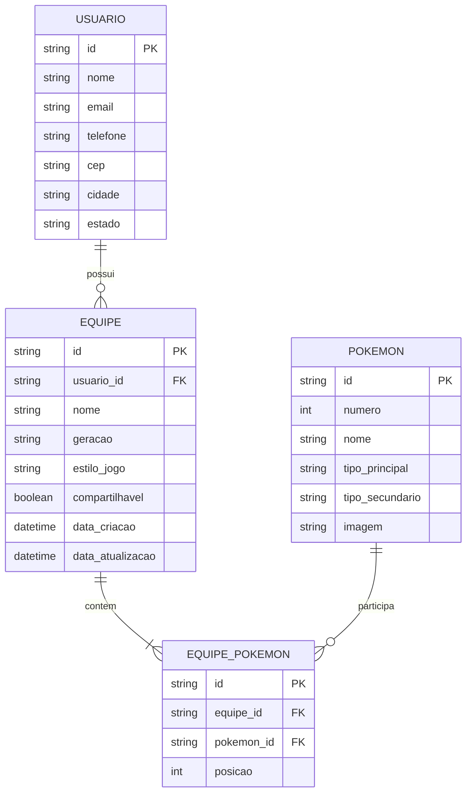

# Especificação Técnica — Pokémon Team Builder

## 1. Visão Geral da Arquitetura

O **Pokémon Team Builder** será desenvolvido como uma aplicação web client-side, responsável pela interface, interação com o usuário, validação dos formulários e comunicação com APIs externas e uma API fake para persistência dos dados.

A arquitetura será organizada de forma modular, separando:

* **Interface (UI):** páginas, componentes, cards, formulários e modais.
* **Lógica da aplicação:** regras para montagem e gerenciamento das equipes.
* **Serviços:** comunicação com APIs externas e API fake.
* **Persistência local:** `localStorage` e/ou `sessionStorage`.
* **Estilos:** CSS/SCSS, framework CSS e Design System.
* **Dados:** entidades utilizadas pela aplicação.

Fluxo simplificado:

```text
┌──────────────────────┐
│      Usuário         │
└──────────┬───────────┘
           │
           ▼
┌──────────────────────┐
│     Interface Web    │
│ HTML + CSS + jQuery  │
└──────────┬───────────┘
           │
           ▼
┌──────────────────────┐
│   Lógica da aplicação│
│  Team Builder        │
└───────┬──────────────┘
        │
        ├───────────────────┐
        ▼                   ▼
┌───────────────┐    ┌────────────────┐
│ APIs Públicas │    │ API Fake       │
│ Pokémon       │    │ JSON Server    │
│ ViaCEP        │    │ Equipes        │
└───────────────┘    └────────────────┘
        │
        ▼
┌──────────────────────┐
│    Web Storage       │
│ localStorage/session │
└──────────────────────┘
```

---

# 2. Modelo de Dados

O sistema possui como principais entidades:

* **USUARIO:** representa o usuário que utiliza a aplicação.
* **EQUIPE:** representa uma equipe de Pokémon criada pelo usuário.
* **POKEMON:** representa os dados dos Pokémon utilizados no Team Builder.
* **EQUIPE_POKEMON:** representa a relação entre uma equipe e os Pokémon que fazem parte dela.

A entidade `EQUIPE_POKEMON` é necessária porque uma equipe possui vários Pokémon e um Pokémon pode fazer parte de várias equipes diferentes.

Os dados completos dos Pokémon não precisam necessariamente ser cadastrados permanentemente pela aplicação, pois suas informações principais serão obtidas por meio de uma API pública. Entretanto, alguns dados relevantes poderão ser armazenados junto à equipe para preservar a composição criada.

---

# 3. Diagrama Entidade-Relacionamento



---

# 4. Descrição das Entidades

## 4.1 USUARIO

Representa os dados básicos associados ao usuário da aplicação.

Nesta primeira versão, não será obrigatório implementar autenticação. O cadastro existe principalmente para permitir o relacionamento entre um usuário e suas equipes e para suportar o formulário de informações adicionais.

### Atributos

| Campo      | Tipo   | Descrição                            |
| ---------- | ------ | ------------------------------------ |
| `id`       | string | Identificador único do usuário       |
| `nome`     | string | Nome do usuário                      |
| `email`    | string | E-mail do usuário                    |
| `telefone` | string | Telefone informado no formulário     |
| `cep`      | string | CEP informado pelo usuário           |
| `cidade`   | string | Cidade obtida por meio da API ViaCEP |
| `estado`   | string | Estado obtido por meio da API ViaCEP |

---

## 4.2 EQUIPE

Representa uma equipe criada pelo usuário.

Uma equipe pode possuir no máximo **seis Pokémon**.

### Atributos

| Campo              | Tipo     | Descrição                                 |
| ------------------ | -------- | ----------------------------------------- |
| `id`               | string   | Identificador único da equipe             |
| `usuario_id`       | string   | Referência ao usuário proprietário        |
| `nome`             | string   | Nome escolhido para a equipe              |
| `geracao`          | string   | Geração associada à equipe                |
| `estilo_jogo`      | string   | Estilo de jogo escolhido                  |
| `compartilhavel`   | boolean  | Indica se a equipe pode ser compartilhada |
| `data_criacao`     | datetime | Data de criação da equipe                 |
| `data_atualizacao` | datetime | Data da última alteração                  |

---

## 4.3 POKEMON

Representa as informações básicas de um Pokémon utilizado pelo Team Builder.

A maior parte desses dados será obtida dinamicamente por uma **API pública de Pokémon**, portanto a entidade não precisa necessariamente ser alimentada manualmente pelo usuário.

### Atributos

| Campo             | Tipo   | Descrição                                                 |
| ----------------- | ------ | --------------------------------------------------------- |
| `id`              | string | Identificador interno ou identificador retornado pela API |
| `numero`          | int    | Número identificador do Pokémon                           |
| `nome`            | string | Nome do Pokémon                                           |
| `tipo_principal`  | string | Tipo principal                                            |
| `tipo_secundario` | string | Segundo tipo, quando existente                            |
| `imagem`          | string | URL da imagem do Pokémon                                  |

---

## 4.4 EQUIPE_POKEMON

Representa a associação entre uma equipe e seus Pokémon.

Essa entidade funciona como uma tabela associativa entre `EQUIPE` e `POKEMON`.

Ela também permite preservar a **posição** de cada Pokémon na equipe.

### Atributos

| Campo        | Tipo   | Descrição                              |
| ------------ | ------ | -------------------------------------- |
| `id`         | string | Identificador da associação            |
| `equipe_id`  | string | Referência à equipe                    |
| `pokemon_id` | string | Referência ao Pokémon                  |
| `posicao`    | int    | Posição do Pokémon na equipe, de 1 a 6 |

---

# 5. Relacionamentos

## Usuário → Equipe

Um usuário pode possuir várias equipes.

```text
USUARIO 1 ───────── N EQUIPE
```

Exemplo:

```text
Usuário: Seila
│
├── Equipe: "Time Principal"
├── Equipe: "Time Ofensivo"
└── Equipe: "Desafio Gen 1"
```

---

## Equipe → Pokémon

Uma equipe deve possuir entre **1 e 6 Pokémon**.

```text
EQUIPE 1 ───────── N EQUIPE_POKEMON
```

A quantidade máxima de seis integrantes será uma regra de negócio da aplicação.

---

## Pokémon → Equipe

Um mesmo Pokémon pode participar de várias equipes.

```text
POKEMON 1 ───────── N EQUIPE_POKEMON
```

Por exemplo, o Pikachu pode estar presente em várias equipes diferentes.

---

## Equipe ↔ Pokémon

Existe, portanto, uma relação **N:N** entre equipes e Pokémon:

```text
EQUIPE N ───────── N POKEMON
```

Essa relação é implementada por meio da entidade associativa `EQUIPE_POKEMON`.

---

# 6. Regras de Negócio

### RN01 — Limite da equipe

Uma equipe pode possuir no máximo **6 Pokémon**.

### RN02 — Identificação da equipe

Toda equipe deve possuir um identificador único.

### RN03 — Nome da equipe

O nome da equipe é obrigatório para o salvamento.

### RN04 — Pokémon duplicado

Na primeira versão, uma equipe não poderá possuir o mesmo Pokémon mais de uma vez.

### RN05 — Posição

Cada Pokémon ocupa uma posição entre **1 e 6** dentro da equipe.

### RN06 — Exclusão

Ao excluir uma equipe, suas associações em `EQUIPE_POKEMON` também deverão ser removidas.

### RN07 — Dados externos

As informações dos Pokémon serão obtidas dinamicamente por meio de uma API pública.

### RN08 — Validação

Os dados inseridos pelo usuário deverão ser validados no lado cliente antes do envio.

### RN09 — Persistência

As equipes deverão ser persistidas por meio da API fake/JSON Server.

### RN10 — Persistência local

Informações temporárias ou preferências do usuário poderão ser armazenadas utilizando `localStorage` ou `sessionStorage`.

---

# 7. Fluxo de Dados — Montagem de Equipe

O fluxo principal para criação de uma equipe será:

```text
1. Usuário pesquisa Pokémon
            ↓
2. Aplicação consulta API pública
            ↓
3. Dados do Pokémon são retornados
            ↓
4. Aplicação exibe o Pokémon
            ↓
5. Usuário adiciona Pokémon
            ↓
6. Aplicação verifica regras da equipe
            ↓
7. Pokémon é adicionado à composição
            ↓
8. Usuário repete o processo até 6 Pokémon
            ↓
9. Usuário informa os dados da equipe
            ↓
10. Formulário é validado
            ↓
11. Aplicação envia dados para API fake
            ↓
12. Equipe é persistida
```

---

# 8. APIs e Fontes de Dados

## 8.1 API Pública de Pokémon

Será utilizada uma API pública para obter informações dos Pokémon.

Os dados consumidos poderão incluir:

* Nome.
* Número.
* Tipos.
* Imagem.
* Outras características relevantes.

A aplicação deverá tratar possíveis erros de conexão, Pokémon inexistente e indisponibilidade da API.

---

## 8.2 API Fake — JSON Server

A API fake será utilizada para simular a persistência das equipes.

Operações previstas:

```text
GET    /teams
GET    /teams/:id
POST   /teams
PUT    /teams/:id
DELETE /teams/:id
```

A estrutura poderá ser adaptada durante a implementação de acordo com a ferramenta utilizada para simulação do banco de dados.

---

## 8.3 API ViaCEP

A aplicação poderá utilizar a API ViaCEP para consultar informações de endereço a partir do CEP informado pelo usuário.

Fluxo:

```text
CEP informado
     ↓
Validação
     ↓
Consulta à API ViaCEP
     ↓
Cidade + Estado
     ↓
Preenchimento automático do formulário
```

---

# 9. Persistência Local

O `localStorage` e/ou `sessionStorage` poderá ser utilizado para manter informações que não necessitam obrigatoriamente de persistência no servidor.

Exemplos:

```text
team_builder_preferences
current_team
last_search
```

A equipe em edição poderá ser temporariamente armazenada no navegador para evitar a perda da composição caso o usuário atualize a página.

A persistência definitiva das equipes será realizada pela API fake.

---

# 10. Organização Modular Esperada

A estrutura inicial do projeto deverá seguir uma organização semelhante a:

```text
pokemon-team-builder/
│
├── docs/
│   ├── prd.md
│   └── architecture.md
│
├── src/
│   ├── assets/
│   │   ├── images/
│   │   └── icons/
│   │
│   ├── components/
│   │   ├── pokemon-card/
│   │   ├── team-card/
│   │   ├── modal/
│   │   └── form/
│   │
│   ├── pages/
│   │   ├── home/
│   │   ├── builder/
│   │   └── teams/
│   │
│   ├── services/
│   │   ├── pokemon-api.js
│   │   ├── teams-api.js
│   │   └── cep-api.js
│   │
│   ├── styles/
│   │   ├── abstracts/
│   │   ├── components/
│   │   ├── layout/
│   │   └── main.scss
│   │
│   ├── utils/
│   │   ├── validation.js
│   │   └── storage.js
│   │
│   └── main.js
│
├── db/
│   └── db.json
│
├── .gitignore
├── package.json
├── README.md
└── ...
```

Essa estrutura poderá ser ajustada durante a implementação, desde que sejam mantidos os princípios de separação de responsabilidades e organização modular.

---

# 11. Relação entre Arquitetura e Requisitos

| Requisito                     | Solução técnica                                      |
| ----------------------------- | ---------------------------------------------------- |
| Responsividade                | Framework CSS + Flexbox/Grid                         |
| Design System                 | Variáveis SCSS + componentes reutilizáveis           |
| Tipografia responsiva         | `clamp()` + unidades relativas                       |
| Imagens responsivas           | `object-fit`, containers fluidos, WebP e/ou `srcset` |
| Formulários                   | HTML5 + JavaScript/jQuery                            |
| REGEX                         | Funções de validação customizadas                    |
| Web Storage                   | `localStorage` / `sessionStorage`                    |
| API fake                      | JSON Server                                          |
| API de Pokémon                | API pública                                          |
| API de CEP                    | ViaCEP                                               |
| Interatividade                | jQuery                                               |
| Plugin JavaScript             | Plugin jQuery ou biblioteca complementar             |
| Gerenciamento de dependências | Node.js + NPM                                        |
| Qualidade de código           | ESLint + Prettier                                    |
| Versionamento                 | Git + GitHub                                         |
| Documentação                  | README.md + documentação em `/docs`                  |

---

# 12. Considerações

O modelo apresentado representa a estrutura conceitual inicial do sistema. Ele não representa necessariamente o banco de dados definitivo que será utilizado na implementação.

O objetivo nesta etapa é identificar **quais informações o sistema precisa conhecer, armazenar e relacionar**, permitindo que a implementação posterior da API fake ou de um banco de dados seja realizada de maneira organizada.

A arquitetura poderá evoluir durante o desenvolvimento, principalmente caso novas funcionalidades sejam adicionadas ao Team Builder.
