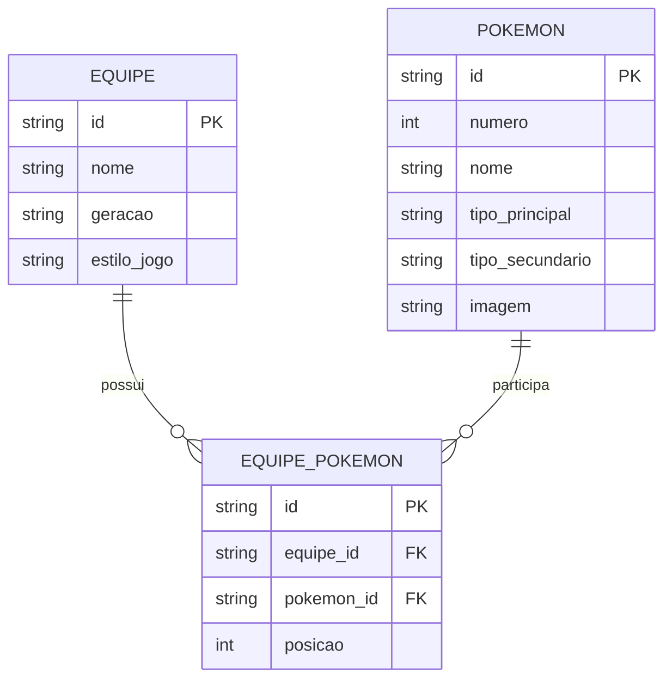

# Nidolab — Modelo de Dados

## Diagrama Entidade-Relacionamento

O Nidolab precisa armazenar as equipes criadas pelo usuário e os Pokémon que fazem parte de cada equipe.

Uma equipe pode possuir até seis Pokémon, e um mesmo Pokémon pode fazer parte de diferentes equipes. Por isso, a relação entre `EQUIPE` e `POKEMON` é representada pela entidade intermediária `EQUIPE_POKEMON`.

## Entidades

### EQUIPE

Representa um time criado pelo usuário.

* `id`: identificador único da equipe.
* `nome`: nome escolhido para o time.
* `geracao`: geração à qual o time está relacionado.
* `estilo_jogo`: estilo de jogo escolhido para a equipe.

### POKEMON

Representa um Pokémon que pode ser utilizado na criação de uma equipe.

* `id`: identificador do Pokémon.
* `numero`: número do Pokémon na Pokédex.
* `nome`: nome do Pokémon.
* `tipo_principal`: tipo principal do Pokémon.
* `tipo_secundario`: segundo tipo, quando existir.
* `imagem`: endereço da imagem do Pokémon.

Os dados dos Pokémon poderão ser obtidos por meio de uma API pública.

### EQUIPE_POKEMON

Representa a associação entre uma equipe e os Pokémon que fazem parte dela.

* `id`: identificador da associação.
* `equipe_id`: identifica a equipe.
* `pokemon_id`: identifica o Pokémon.
* `posicao`: posição do Pokémon dentro da equipe, de 1 a 6.
