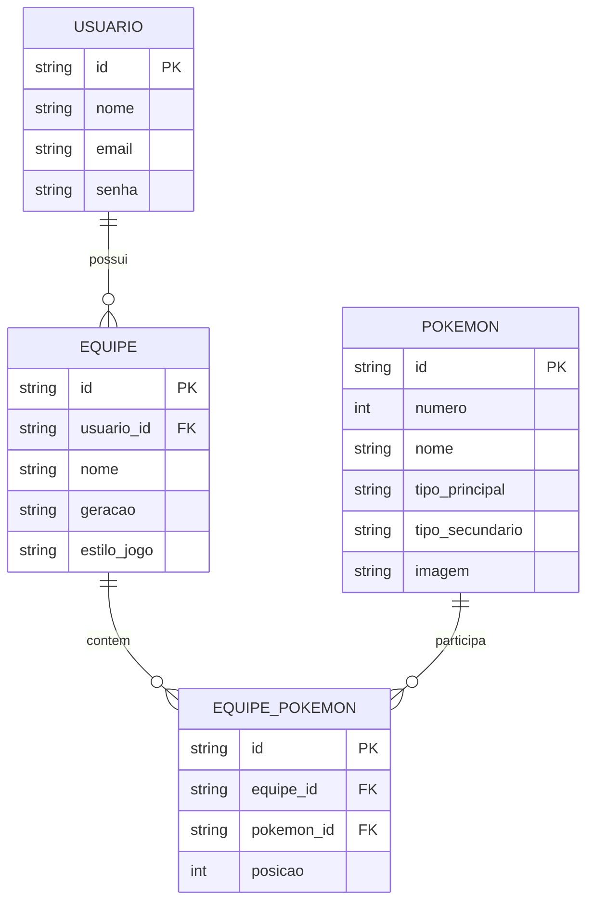

# Modelo de Dados — Nidolab

## Diagrama Entidade-Relacionamento

O Nidolab precisará armazenar os dados dos usuários, das equipes criadas e dos Pokémon que fazem parte de cada equipe.

Como um usuário pode criar várias equipes e uma equipe pode possuir vários Pokémon, será utilizada a entidade intermediária `EQUIPE_POKEMON` para representar a relação entre equipes e Pokémon.

### Entidades

**USUARIO:** armazena os dados necessários para identificação e login do usuário.

**EQUIPE:** armazena as equipes criadas pelos usuários, incluindo seu nome, geração e estilo de jogo.

**POKEMON:** representa os Pokémon disponíveis para serem adicionados às equipes. Seus dados poderão ser obtidos por meio de uma API pública.

**EQUIPE_POKEMON:** relaciona os Pokémon às equipes e registra a posição de cada Pokémon dentro da equipe.
